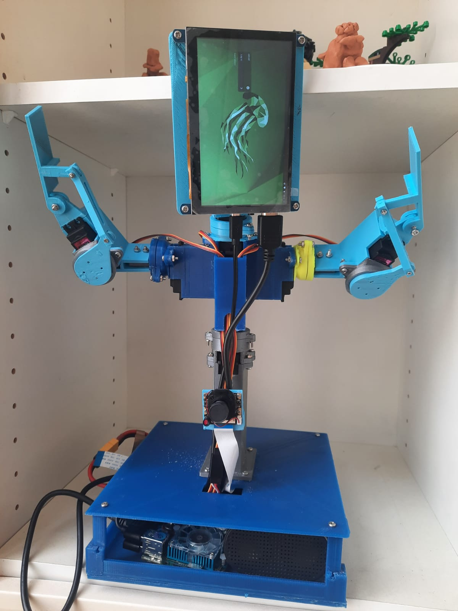

# Valera
Open source hardware and software social robot.

The goal behind the project is to make a social robot with AI on board as cheap and as easy to build and use as it possible.

The project is managed by GoodLancer team.