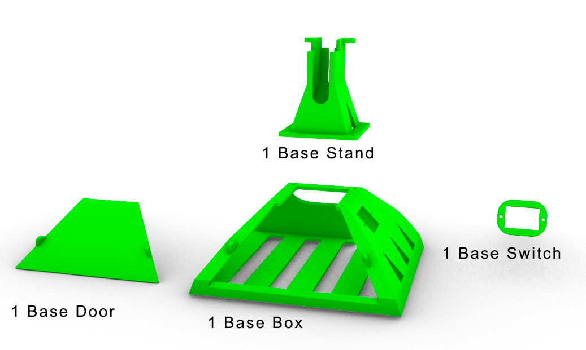
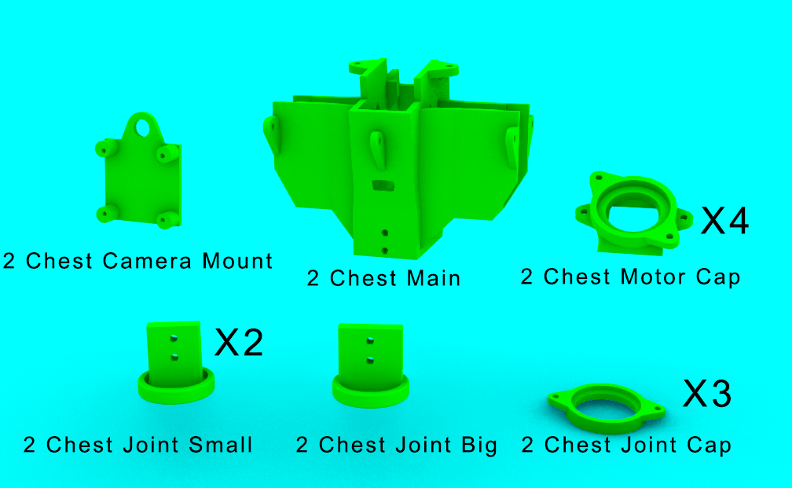
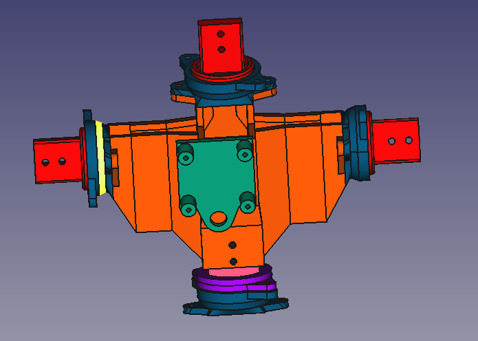
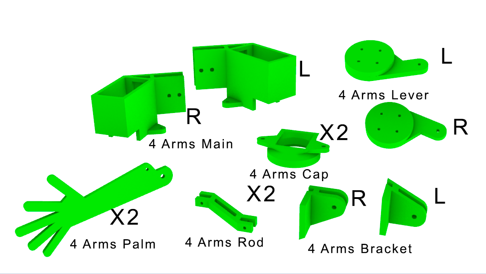

Printing the parts
=========================

Facilities
--------------------

Every 3D printer can be used, the only requirement is to have a table not smaller than 20cmx20cm, because it's the size of our biggest part.
Also every type of filament can be used, we have used PLA.
No special knowledge is need, if you know the very basics of 3d printing, you can print the project.

All time assumptions are made for printer Prusa Mk4 with 0.4mm nozzle with 20% unless otherwise said.

Parts
---------------------

    The robot assembly 

The robot body consists of 4 main blocks:

* 1 - Base (red)
* 2 - Chest (green)
* 3 - Head (blue)
* 4 - Arms (yellow)

.. raw:: html

    
 
    <iframe title="Social robot Valera (assembly)" frameborder="0" allowfullscreen mozallowfullscreen="true" webkitallowfullscreen="true" allow="autoplay; fullscreen; xr-spatial-tracking" xr-spatial-tracking execution-while-out-of-viewport execution-while-not-rendered web-share width="640" height="480" src="https://sketchfab.com/models/b62bbd69dae34dabb491808437f7caf9/embed?autostart=1"> 
    </iframe> 
 
    <a href="https://sketchfab.com/3d-models/social-robot-valera-assembly-b62bbd69dae34dabb491808437f7caf9?utm_medium=embed&utm_campaign=share-popup&utm_content=b62bbd69dae34dabb491808437f7caf9" target="_blank" rel="nofollow" style="font-weight: bold; color: #1CAAD9;"> 
    Social robot Valera (assembly) </a> by 
    <a href="https://sketchfab.com/goodlancer?utm_medium=embed&utm_campaign=share-popup&utm_content=b62bbd69dae34dabb491808437f7caf9" target="_blank" rel="nofollow" style="font-weight: bold; color: #1CAAD9;"> 
    GoodLancer </a>

|

Total weight of filament needed for all the parts is about 680 g .
Total printing time on a fast rate will be around 24 hours .

Both STL files to print and source models for FreeCAD can be found 
on `Github <https://github.com/goodlancer-org/valera>`_ in `STL` and `3d source` folder
respectively.

1 - Base
--------------------------------

    Base assembly

* 1_Base_Box - 270 g printing time 9 h
* 1_Base_Stand - 55 g printing time 1 h
* 1_Base_Door - 25 g printing time 2 h
* 1_Base_Switch - 3 g printing time 8 mins

Total weight of the Base parts is 353 g and total time is 12 hours.

    Base parts

2 - Chest
--------------------------------

* 2_Chest_Main - 77 g printing time 3 h 
* 2_Chest_joint_Big - 8 g printing time 20 mins
* 2_Chest_joint_Small - 7 g printing time 20 mins X2
* 2_Chest_joint_Cap -  3 g printing time 8 mins X3
* 2_Chest_Motor_Cap - 7 g printing time 17 mins X3
* 2_Chest_Camera_Mount - 6 g printing time 18mins

Total weight of the Chest parts is 129 g and total printing time is 5 hours 30 minutes

3 - Head
--------------------------------

* 3_Head_Main - 65 g printing time 1 h 23 mins
* 3_Head_Mount - 8 g printing time 14 mins

Total weight of the Head parts is 73 g and total printing time is 1 hours 40 minutes

.. image:: images/3dprint/ValeraHead3d.png

.. image:: images/3dprint/ValeraHeadAssm3d.PNG

4 - Arm 
--------------------------------

* 4_Arms_Rod - 3 g printing time 10 mins X2
* 4_Arms_Lever_R - 7 g printing time 12 mins
* 4_Arms_Lever_L - 7 g printing time 12 mins
* 4_Arms_Bracket_R - 8 g printing time 19 mins
* 4_Arms_Bracket_L - 8 g printing time 19 mins
* 4_Arms_Main_R - 26 g printing time 52 mins
* 4_Arms_Main_L - 26 g printing time 52 mins
* 4_Arms_Cap - 6 g printing time 15 mins X2
* 4_Arms_Palm - 10 g printing time 24 mins X2

Palm and Rod have to be printed with 100% filling.

Total weight of the two Arms parts is 123 g and total printing time is 4 hours 25 minutes

