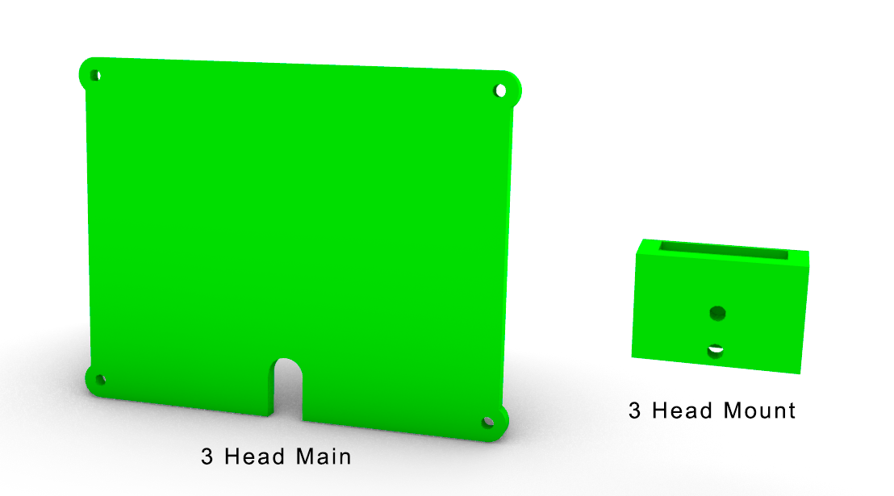

Printing the parts
=========================

The robot body consists of 5 main blocks:

* 1 - Base
* 2 - Chest
* 3 - Head
* 4 - UpperArm
* 5 - Forearm

Total weight of filament needed for all the parts is about 1000 g .
Using fast printing with the speed 50g/hour total printing time will be 18 hours .

Both STL files to print and source models for FreeCAD can be found 
on `Github <https://github.com/goodlancer-org/valera>`_ in `STL` and `3d source` folder
respectively.

1 - Base
--------------------------------

* 1_Base_Box - 460 g 
* 1_Base_Stand - 55 g
* 1_Base_Door - 20 g 
* 1_Base_Switch - 5 g 
* 2_Chest_joint_Cap -  5 g
* 2_Chest_Motor_Cap - 10 g

Total weight of the Base parts is 555 g 

.. image:: images/3dprint/ValeraBase3d.png

2 - Chest
--------------------------------

* 2_Chest_Main_2 -  60 g
* 2_Chest_Main_1 - 25 g * 2
* 2_Chest_joint_Big - 5 g
* 2_Chest_joint_Small - 5 g * 2
* 2_Chest_joint_Cap -  5 g * 3
* 2_Chest_Motor_Cap - 10 g * 3

Total weight of the Chest parts is 170 g

.. image:: images/3dprint/ValeraChest3d.png

3 - Head
--------------------------------

* 3_Head - 45 g 
* 3_Head_Mount - 10 g 

Total weight of the Head parts is 55 g

4 - UpperArm 
--------------------------------

* 4_UpperArm_Rod - 5 g * 2
* 4_UpperArm_Lever - 5 g * 2
* 4_UpperArm_Bracket - 5 g * 2
* 4_UpperArm_Main - 30 g * 2
* 4_UpperArm_Cap - 5 g * 2

Total weight of the UpperArm parts is 100 g

.. image:: images/3dprint/ValeraUpperArm3d.png

5 - ForeArm 
--------------------------------

* 5_Forearm_Main - 10 g * 2

.. image:: images/3dprint/ValeraForearmMain3d.png