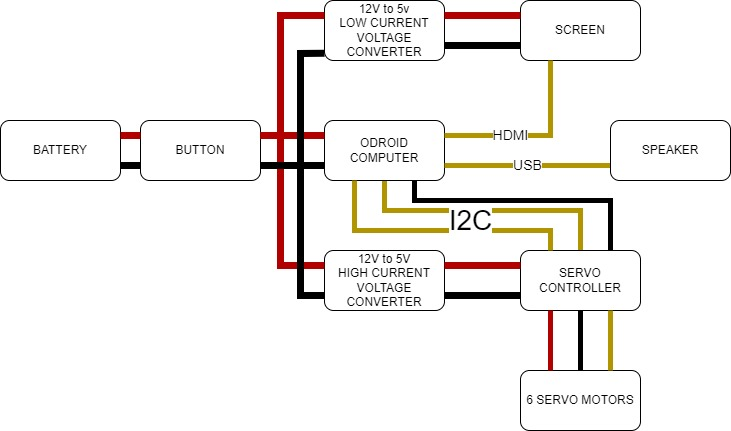
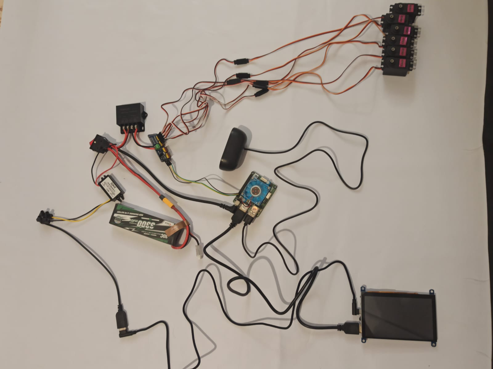
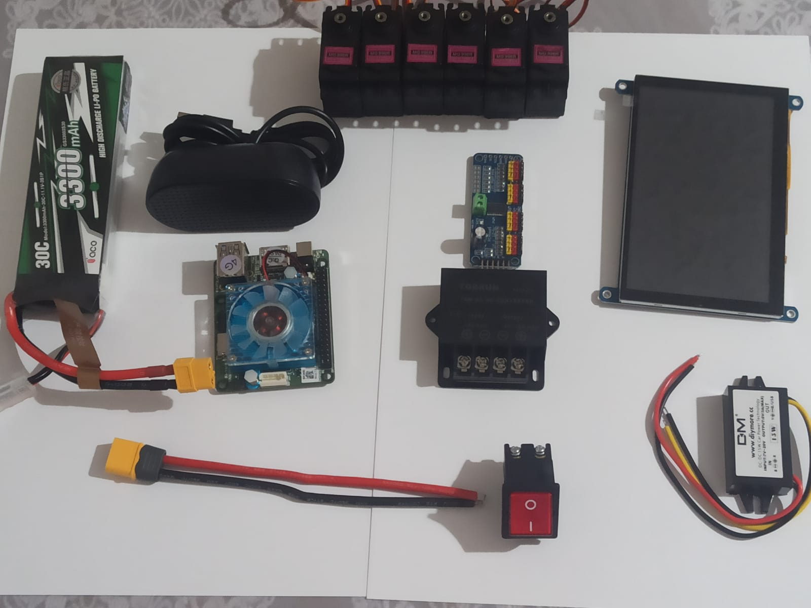
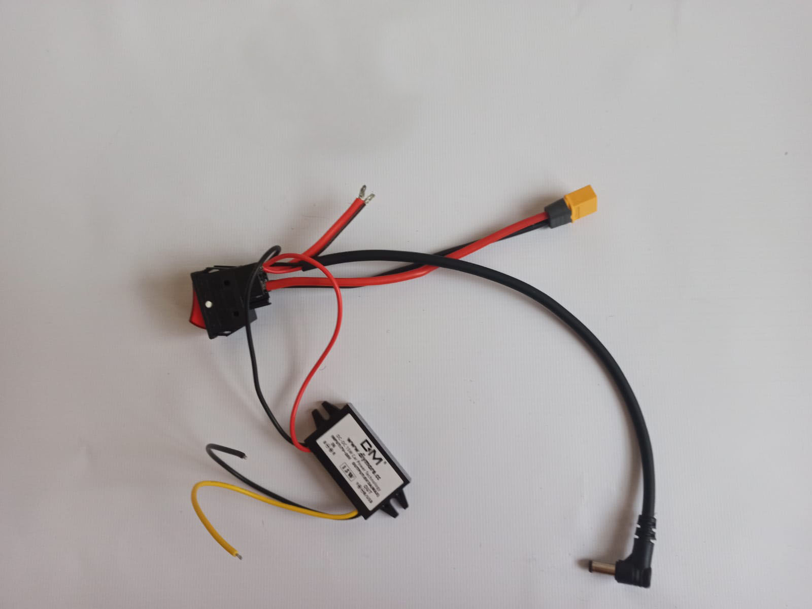
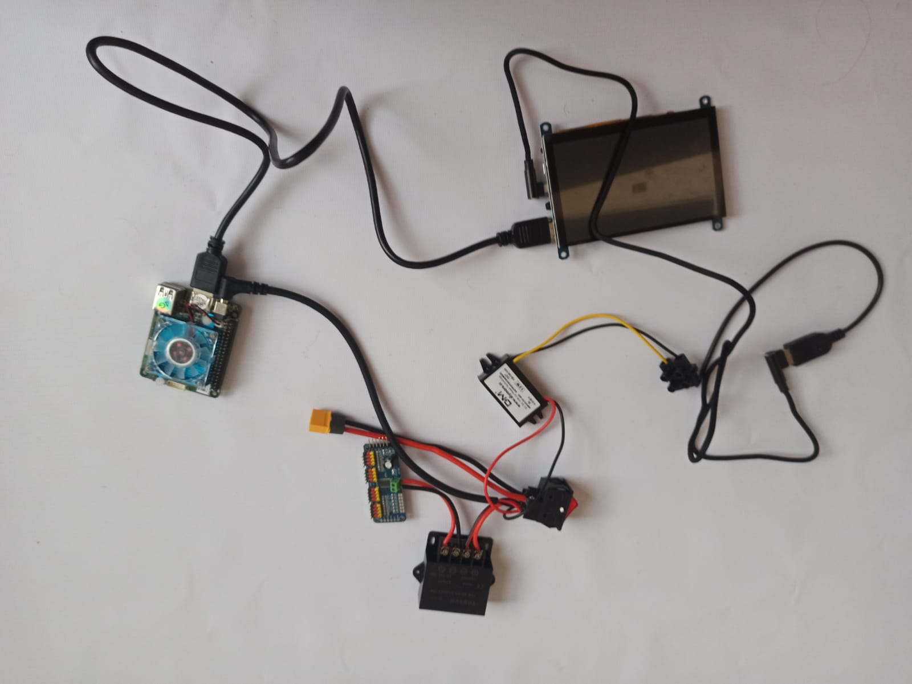
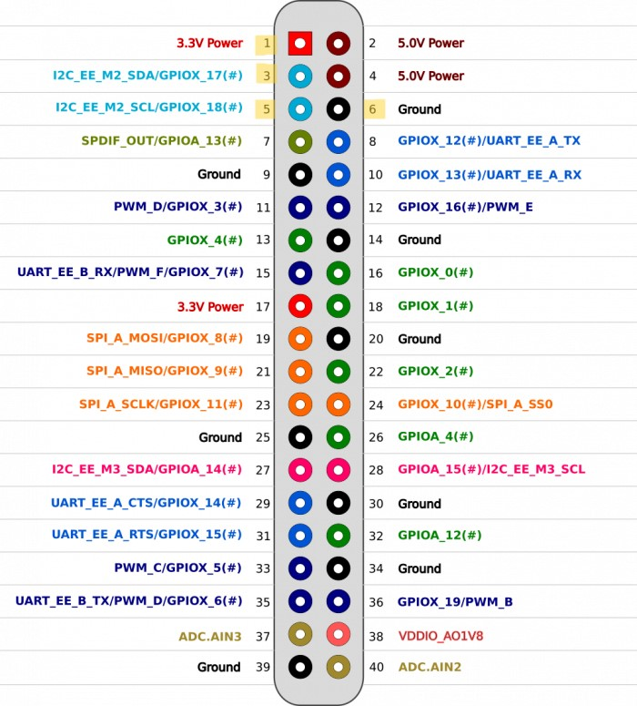
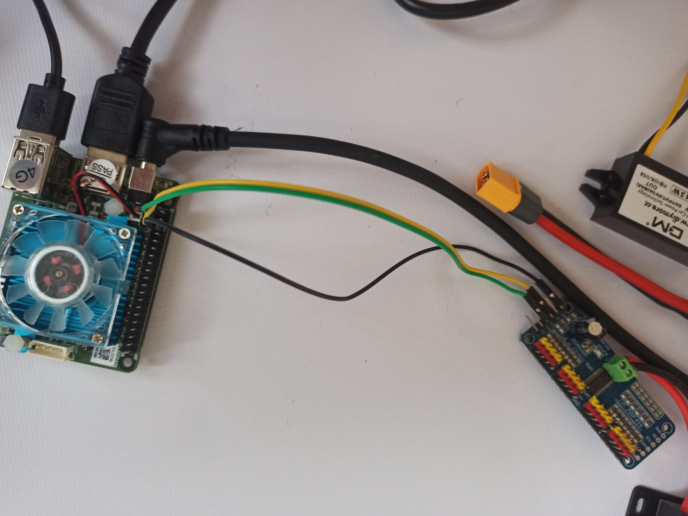
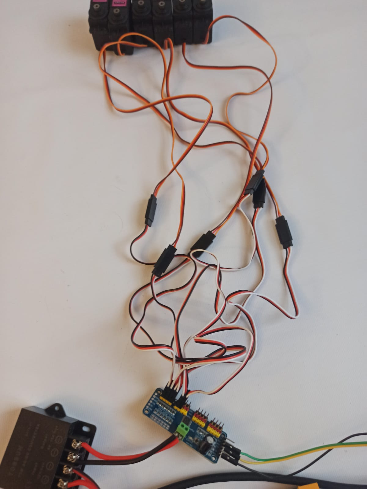
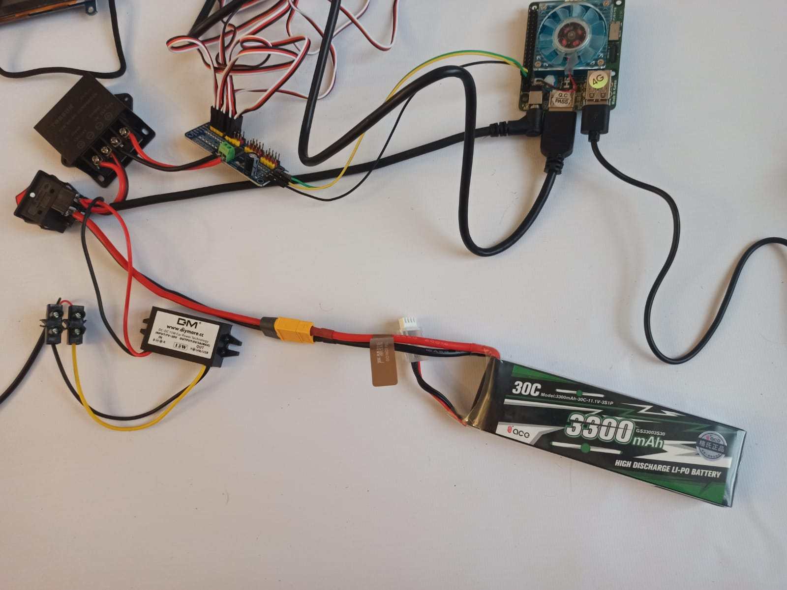

Electric Curcuit
==================
On picture below you may see a block scheme depicting how Valera's electric curcuit is composed.

That's how it looks in reality

Before we start:
~~~~~~~~~~~~~~~~

Step 1. Connect the button with low current circuit
~~~~~~~~~~
Connect low current voltage converter, two wires and jack cable to the button from one side and XT60 wire from another side. Mind the polarity.

.. image:: images/Electric_Curcuit_Assm/Assm_Step1_1.jpg

Step 2. Connect the button with high current circuit
~~~~~~~~~~
Connect an input of the high current voltage converter to the two wires we connected to the button before. Mind the polarity.

.. image:: images/Electric_Curcuit_Assm/Assm_Step2.jpg

Step 3. Connect servo wires
~~~~~~~~~~~
Connect a Servo Controller through two wires to the output of the high current voltage converter. Mind the polarity.

.. image:: images/Electric_Curcuit_Assm/Assm_Step3.jpg

Step 4. Connect USB to voltage converter
~~~~~~~~~~~~
Connect the USB wire to the output of the low current voltage converter, I used screw connectors for myself. Mind the polarity.

.. image:: images/Electric_Curcuit_Assm/Assm_Step4.jpg

Step 5. Power up display
~~~~~~~~~~~~
Plug in the USB wire to the display through USB to micro USB L-shaped cable.

.. image:: images/Electric_Curcuit_Assm/Assm_Step5.jpg

Step 6. Power up Odroid
~~~~~~~~~~~~
Plug the jack cable in the Odroid.

.. image:: images/Electric_Curcuit_Assm/Assm_Step6.jpg

Step 7. Power up display
~~~~~~~~~~~~
Connect the display to the Odroid with HDMI cable.

Step 8. Plug in speaker
~~~~~~~~~~~
Plug the speaker into the Odroid. You may use the USB port you like.

.. image:: images/Electric_Curcuit_Assm/Assm_Step8.jpg

Step 9. Connect Odroid and servo controller
~~~~~~~~~~~~
Connect the Servo Controller to the Odroid. You need three wires: SCL, SDA and GND. 
Pinout is written on the controller itself, and pinout for Odroid you can see here:

Step 10. Connect servo controller and motors
~~~~~~~~~~~~
Connect all 6 Servos to the Servo Controller through servo extension wires. Make sure you plug data cables to the data pins and mind the polarity.

Step 11. Connect the battery
~~~~~~~~~~~~~
Connect the battery to the XT60 wire.

Finish
~~~~~~~~~~~~~
Congratulations!!! Now you can put the ssembled scheme into base box and procced to the next step in creating your own Valera!!!

