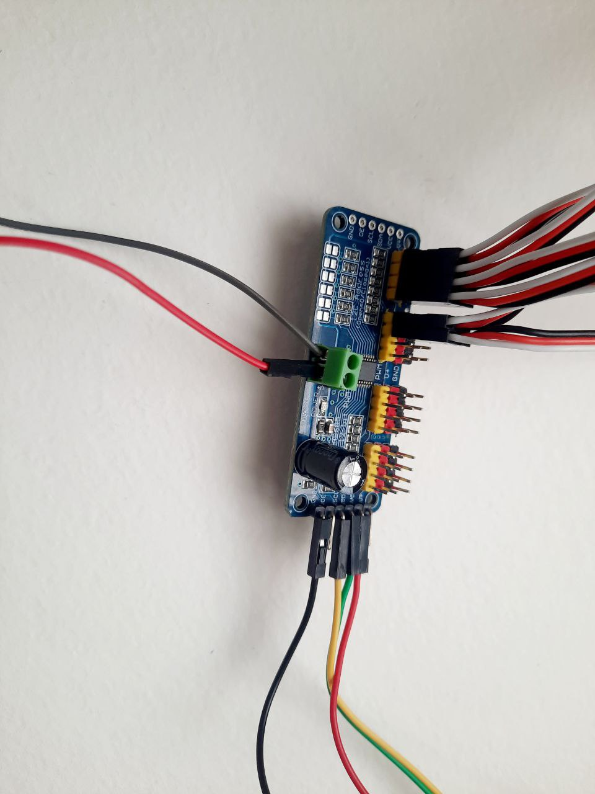

Electric Curcuit
==================
On picture below you may see a block scheme depicting how Valera's electric curcuit is composed.

.. image:: images/Electric_Curcuit_Assm/Block_Scheme.jpg

That's how it looks in reality

.. image:: images/Electric_Curcuit_Assm/Assembled.jpg

Assebling Instruction
---------------------
Before we start:
~~~~~~~~~~~~~~~~
.. image:: images/Electric_Curcuit_Assm/Deassembled.jpg

Step 1
~~~~~~~~~~
Connect low current voltage converter, two wires and jack cable to the button form one side and XT60 wire from another side. Mind the polarity.

.. image:: images/Electric_Curcuit_Assm/Assm_Butt_VoltConvLowCur_D.jpg

.. image:: images/Electric_Curcuit_Assm/Assm_Butt_VoltConvLowCur_A.jpg

Step 2
~~~~~~~~~~
Connect an input of the high current voltage converter to the two wireswe connected to the button before. Mind the polarity.

.. image:: images/Electric_Curcuit_Assm/Assm_VoltConvHighCur.jpg

Step 3
~~~~~~~~~~~
Connect a Servo Controller through two wires to the output of the high current voltage converter. Mind the polarity.

.. image:: images/Electric_Curcuit_Assm/Assm_ServCont.jpg

Step 4
~~~~~~~~~~~~
Connect the USB wire to the output of the low current voltage converter, I used screw connectors for myself. Mind the polarity.

.. image:: images/Electric_Curcuit_Assm/Assm_USBCab.jpg

Step 5
~~~~~~~~~~~~
Plug in the USB wire to the screen through USB to micro USB L-shaped cable.

.. image:: images/Electric_Curcuit_Assm/Assm_Screen.jpg

Step 6
~~~~~~~~~~~~
Plug the jack cable in the Odroid.

.. image:: images/Electric_Curcuit_Assm/Assm_Odroid.jpg

Step 7
~~~~~~~~~~~~
Connect the screen to the Odroid through HDMI cable.

.. image:: images/Electric_Curcuit_Assm/Assm_ScreenToOdroid.jpg

Step 8
~~~~~~~~~~~
Plug the speaker into the Odroid. You may use the USB port you like.

.. image:: images/Electric_Curcuit_Assm/Assm_Speaker.jpg

Step 9
~~~~~~~~~~~~
Connect the Servo Controller to the Odroid. You need three wires: SCL, SDA and GND. 
Pinout is written on the controller itself, and pinout for Odroid you can see here:

.. image:: images/Electric_Curcuit_Assm/Assm_OdroidToServCont.jpg

Step 10
~~~~~~~~~~~~
Connect all 6 Servos to the Servo Controller through servo extension wires. Make sure you plug data cables to the data pins and mind the polarity.

Step 11
~~~~~~~~~~~~~
Connect the battery to the XT60 wire.

.. image:: images/Electric_Curcuit_Assm/Assm_Batt.jpg

Finish
~~~~~~~~~~~~~
Congratulations!!! Now you can put the ssembled scheme into base box and procced to the next step in creating your own Valera!!!

