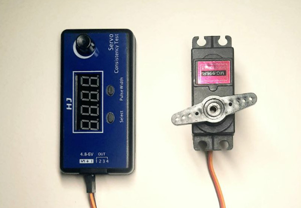

Servo motors
==================

Servo motors drive Valera and this is essential to set the up and test like it's show on the video below.

.. raw:: html

    <iframe width="560" height="315" 
    src="https://www.youtube.com/embed/7wUNU5IKYxU?si=-xs0XWdKWBbhhZVB" 
    title="Valera robot YouTube video" frameborder="0" 
    allow="accelerometer; autoplay; clipboard-write; encrypted-media; gyroscope; picture-in-picture; web-share" allowfullscreen>
    </iframe>

|

A servo motor is a motor equipped with an integrated movement sensor, 
typically a simple potentiometer, which allows for the control of the motor's rotation angle. 
Here's the schematic diagram:

    Servo Scheme

There are two types of servo motors: angle-controlled and speed-controlled. 
Here we focus solely on the angle-controlled ones.

Angle servos are commonly referred to as 180-degree servos, but in reality, 
their range may vary and is not always exactly 180 degrees. 
It can be around 120, 270, or even 360 degrees, depending on the specific servo you purchase. 
In our case, it's approximately 120 degrees, 
so you must always be mindful of the position when installing a servo in your project 
to maximize its potential.

Servos are operated by sending them serial pulses, 
where the width of the pulse instructs the motor on which angle to turn.

    Servo Signal

For testing or manually adjusting servos when necessary, we use a servo tester device. 
This device allows you to connect and control several motors simultaneously, 
which is particularly useful for checking the angle range of your motors or verifying the accuracy 
of your assembly.

    Servo Tester

When you need to control your servos automatically, you use a servo controller. 
It's a compact circuit board that typically receives PWM signals, 
although there may be variations, 
so it's essential to consult your controller's documentation for specific details.

    Servo Controller
