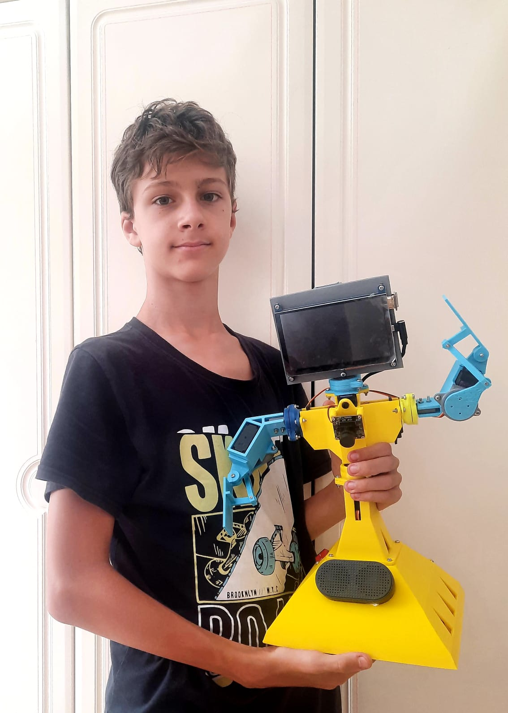

About Valera social robot
=========================

Valera is a social robot aimed to be the cheapest one able to communicate with people and emotionally react to them.
Valera can act as a friend or a teacher. 

Technologies and components used
--------------------------------

* Single-board computer like Raspberry PI or Odroid as a braind with AI, camera and sound sensors
* 3d-printing with regular PLA
* Cost-effective servo motors and electronics

Get the files
-------------

The files - 3d source, STL files for 3d-printing and code for the robot is available on `Github <https://github.com/goodlancer-org/valera>`_ . 
Electronics components can be bought anywere, please see :doc:`supplies`.

License
-------

Valera (both software and hardware) is licensed under the MIT license. 
This means that you are free to modify, distribute and republish the source code 
on the condition that the copyright notices are left intact. 
You are also free to incorporate Valera into any Commercial or closed source application.