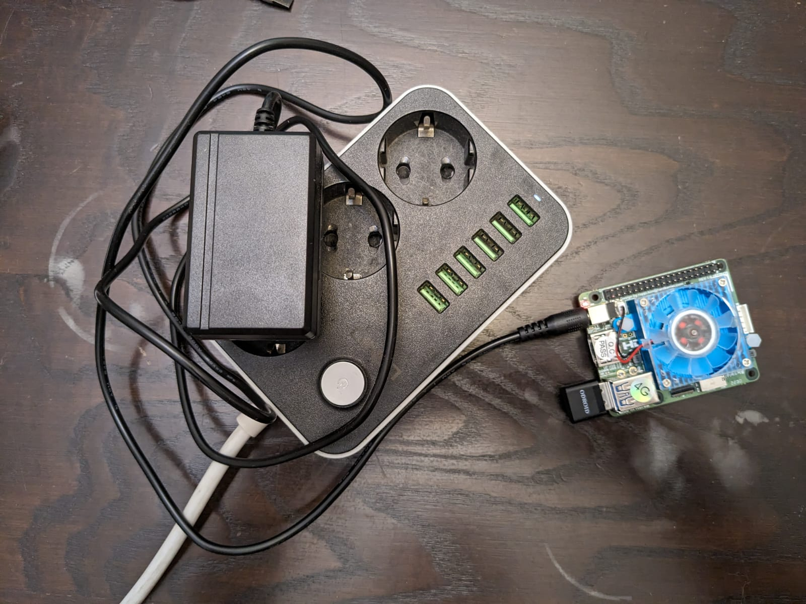
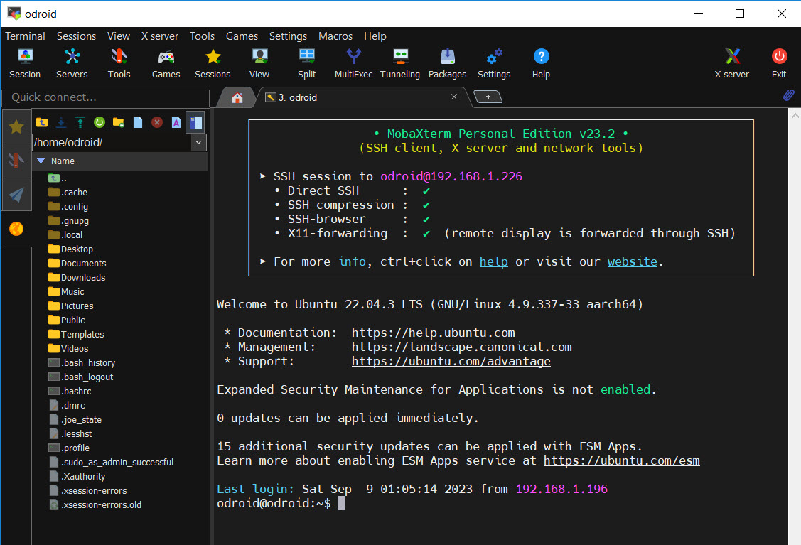
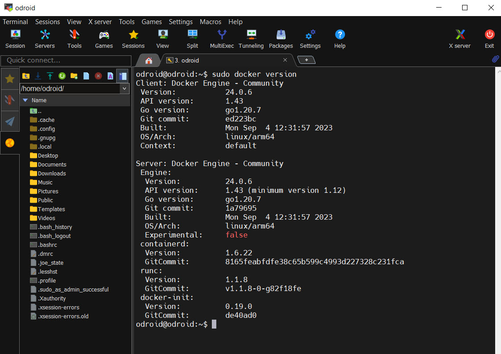
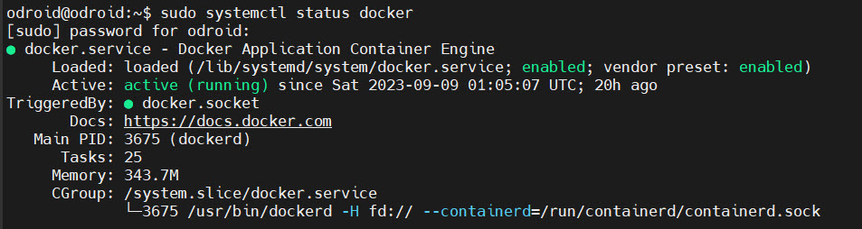
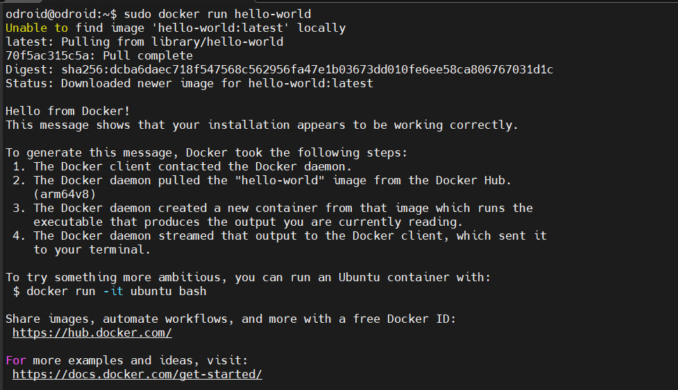
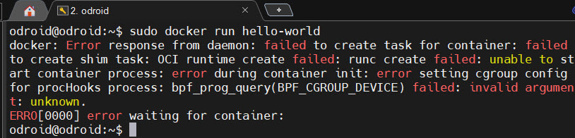
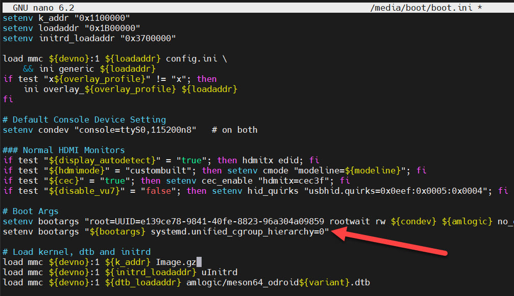
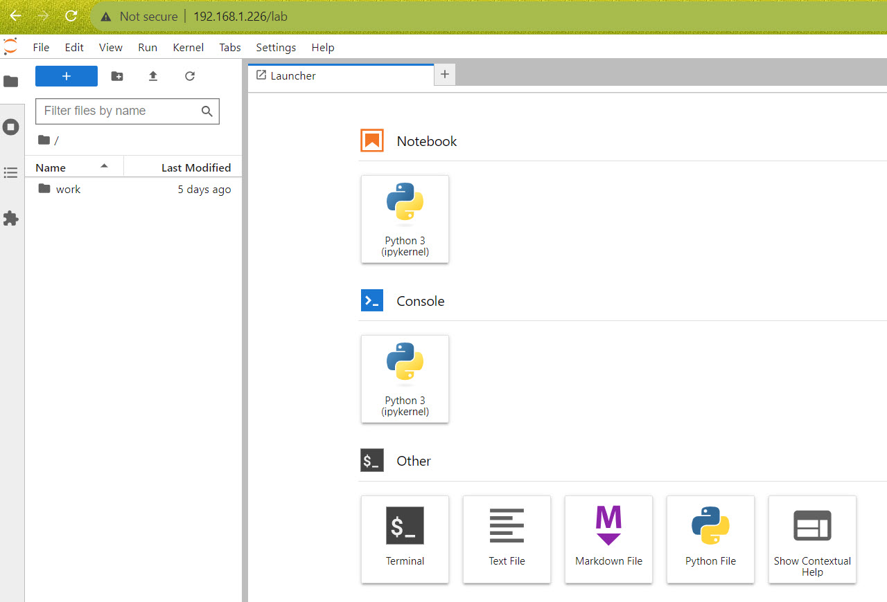

Launch a web server on Odroid
================================

We install a container management system, docker, onto Odroid to run any software
from image files with no need to install anything else to the microcomputer but
the docker. Finally we'll test the docker by running a web server with popular
interactive development environment (IDE) - jupyterlab.

Web server running on Ordoid provides access to the microcomputer
from any device in the same WiFi network, i.e. from laptop.

Before we start
~~~~~~~~~~~~~~~~~

To install docker we have to have:

* single board computer Odroid with WiFi and SSH set and running
* Odroid power cable
* SSH terminal client software installed on PC or laptop. We'll be using MobaXTerm for
demonstration purposes, but any other SSH terminal client can be used.

Step 1. Power up Odroid
~~~~~~~~~~~~~~~

Ensure that WiFi donglo is inserted into an Odroid USB port and
WiFi connection is set for the microcomputer. Power up Odroid and connect to it
with MobaXTerm.

Step 2. Install docker on Odroid
~~~~~~~~~~~~~~~~~~~

Now we can manage Odroid from MobaXTerm window as it we were working directly on
the microcomputer over command line terminal.

Let's update the system first:

``sudo apt-get update && sudo apt-get upgrade``

``sudo apt install ca-certificates curl gnupg lsb-release``

Install docker itself using the official installation script:

``sudo curl -sSL https://get.docker.com | sh``

Step 3. Check if the docker is working
~~~~~~~~~~~~~~~~~~~

First, let's check if the docker installed using ``sudo docker version`` or ``sudo docker info``

If everything is ok the version info appears:

Now check if the docker is running by typing ``sudo systemctl status docker``:

Next, let's try running a simple container:

``sudo docker run hello-world``

If you're using a stock Odroid linux image you might encounter a problem with permissions
to use docker which look like one on the next picture: 

If you see this error perform the action shown on the next stem and try running
hello-world docker container again.

Step 4. Fix cgroup error
~~~~~~~~~~~~~~~~~~~

To do so we'll need to add a line of code in the boot file.

Run ``sudo nano /media/boot/boot.ini`` and add a line 
``setenv bootargs "${bootargs} systemd.unified_cgroup_hierarchy=0"``
as it shown on picture below:

Now try running ``sudo docker run hello-world`` again and everything should be working.

Step 5. Run JupyterLab
~~~~~~~~~~~~~~~~~~~

JupyterLab is a popular IDE for data scientists and not only for them.
We can run it on our Odroid in docker and access is from any computer in the same
WiFi network.

Let's run a container with JupyterLab:
``sudo docker run -p 80:8888 jupyter/base-notebook start-notebook.sh --IdentityProvider.token=''``

Now this container runs on Odroid, but it's also exposed to the local network.
The JupyterLab can be accessed from another computer usind the Odroid's IP address,
just type ``http://[your_odroid_address]`` in your browser:

Finish
~~~~~~~~~~~~~~~~~~~

Now python code or shell commands can be executed on docker container running on Odroid,
but some additional settings will be needed to get access to the camera or motors of a robot.