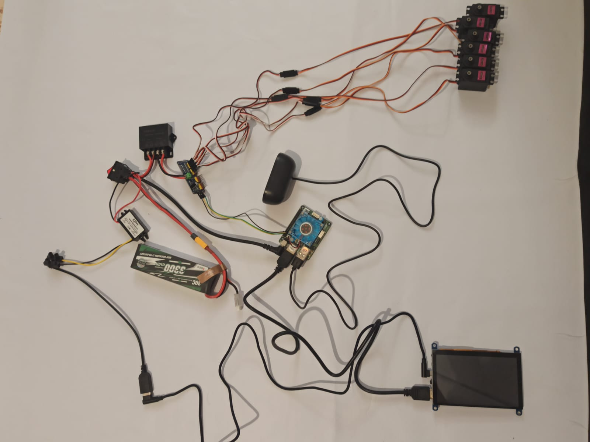

Electric Curcuit
==================
On picture below you may see a block scheme depicting how Valera's electric curcuit is composed.
Please note that different versions of the robot uses different microcomputers.
Valera v0.1 utilises microcomputer ODROID-N2L whereas Valera v0.2 utilises Orange PI 3B.
Some images on this page are not updated to the new version of the robot, so if you
see 'Odroid' on the picture - it means any microcomputer, Odroid or Orange PI, otherwise
the difference should be stated in the text.

.. image:: images/Electric_Curcuit_Assm/Block_Scheme.jpg

|

That's how it looks in reality

Assebling Instruction
---------------------

Before we start:
~~~~~~~~~~~~~~~~

.. image:: images/Electric_Curcuit_Assm/Deassembled.jpg

Please watch the assembling process video or read a full instruction below.

|

.. raw:: html

    <iframe width="560" height="315" 
    src="https://www.youtube.com/embed/S_Jwx7noY1A?si=5r4jmpi5huq4Ma-H" 
    title="Assembly guide for the electrical circuit of the Valera robot" frameborder="0" 
    allow="accelerometer; autoplay; clipboard-write; encrypted-media; gyroscope; picture-in-picture; web-share" allowfullscreen>
    </iframe>

Step 1
~~~~~~~~~~
Connect low current voltage converter, two wires and jack cable
to the button form one side and XT60 wire from another side. Mind the polarity.

.. image:: images/Electric_Curcuit_Assm/Assm_Butt_VoltConvLowCur_D.jpg

|

.. image:: images/Electric_Curcuit_Assm/Assm_Butt_VoltConvLowCur_A.jpg

Step 2
~~~~~~~~~~
Connect an input of the high current voltage converter to the two wires
we connected to the button before. Mind the polarity.

Step 3
~~~~~~~~~~~
Connect a Servo Controller through two wires to the output of the high current voltage converter. 
Mind the polarity.

.. image:: images/Electric_Curcuit_Assm/Assm_ServCont.jpg

Step 4
~~~~~~~~~~~~
Attach the USB wire to the low current voltage converter’s output using screw connectors. 
Pay attention to the polarity.

.. image:: images/Electric_Curcuit_Assm/Assm_USBCab.jpg

Step 5
~~~~~~~~~~~~
Plug in the USB wire to the screen through USB to micro USB L-shaped cable.

.. image:: images/Electric_Curcuit_Assm/Assm_Screen.jpg

Step 6
~~~~~~~~~~~~
Plug the jack cable in the Odroid.

.. image:: images/Electric_Curcuit_Assm/Assm_Odroid.jpg

Step 7
~~~~~~~~~~~~
Connect the screen to the microcomputer with HDMI cable.

.. image:: images/Electric_Curcuit_Assm/Assm_ScreenToOdroid.jpg

Step 8
~~~~~~~~~~~
Connect the speaker to the microcomputer using any USB port.

.. image:: images/Electric_Curcuit_Assm/Assm_Speaker.jpg

Step 9
~~~~~~~~~~~~
Connect the servo controller to the microcomputer using the SCL, SDA, and GND wires. 
The pinout is labeled on the controller. Both microcomputers has the same pinout
, please see it below:

.. image:: images/Electric_Curcuit_Assm/odroid_pinout.jpg

|

Step 10
~~~~~~~~~~~~
Connect the 6 servos to the servo controller using extension wires. 
Ensure that you connect the data cables to the correct data pins and pay attention to the polarity.

.. image:: images/Electric_Curcuit_Assm/Assm_Servos.jpg

Step 11
~~~~~~~~~~~~~
Connect the battery to the XT60 wire.

Finish
~~~~~~~~~~~~~
Congratulations!!! 
Now you can put the assembled scheme into base box and procced to the next step 
in building your own Valera!!!

