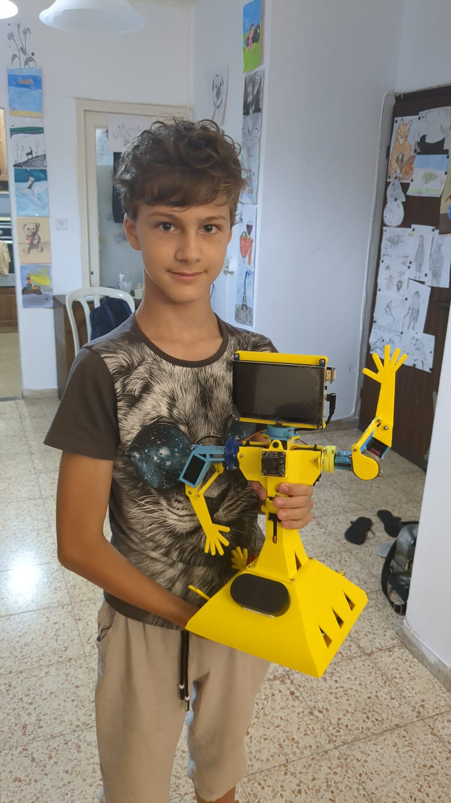

Welcome to social robots' world!
===============================================

Valera is a social robot, which means that the goal is to make robot to be a part of a society, 
keep some human knowledge and human culture, to be able to learn and analyse,
to be able to communicate like people do and to share.

The second goal was to make the robot cheap, affordable and easy to build, even by kids and at home.

.. toctree::
   :maxdepth: 2
   :caption: 👱 About
   :hidden:

   about

.. toctree::
   :maxdepth: 2
   :caption: 🚀 How to build
   :hidden:

   supplies
   3dprint
   electric_circuit

.. toctree::
   :maxdepth: 2
   :caption: 🖳 Software installation
   :hidden:
   
   flash_emmc_os
   odroid_wifi_connect
   docker_and_jupyter
   video_processing
   servos
   sound