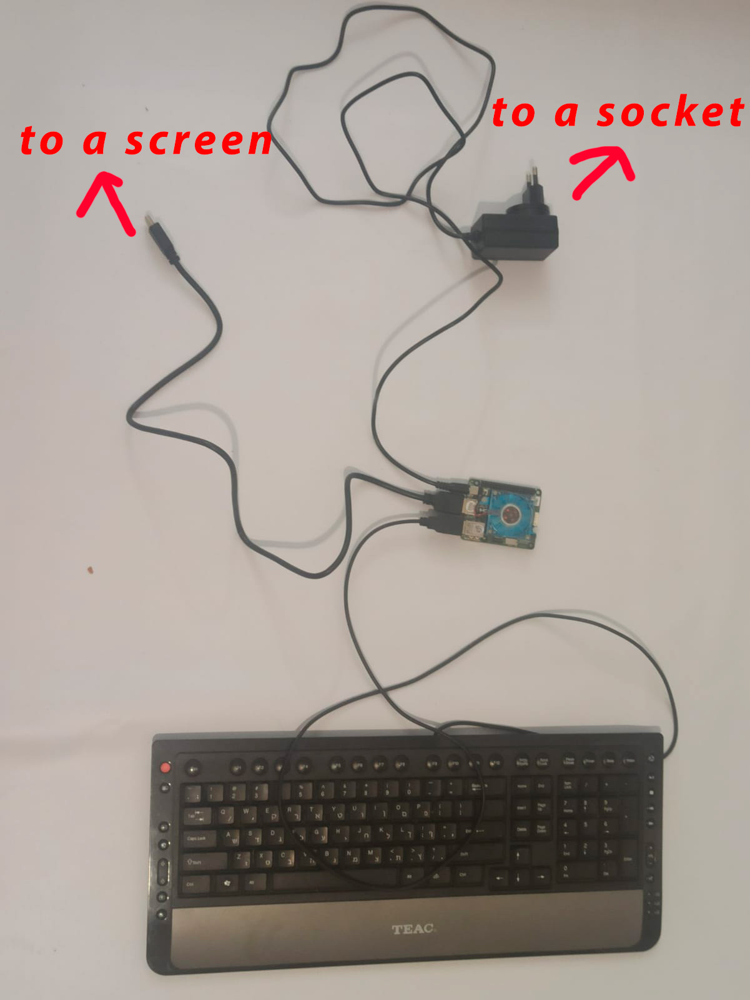
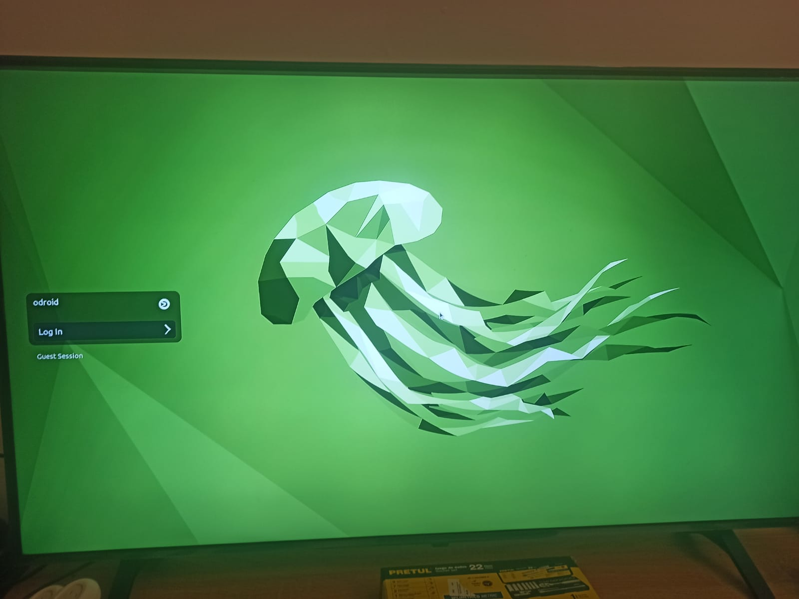
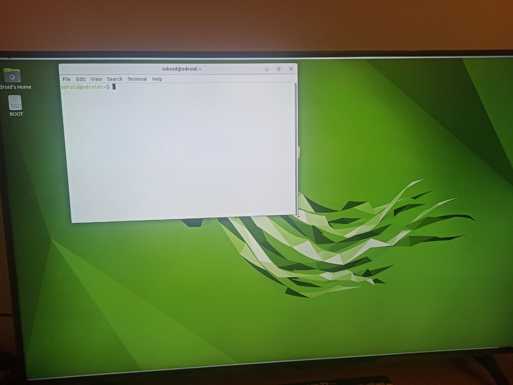
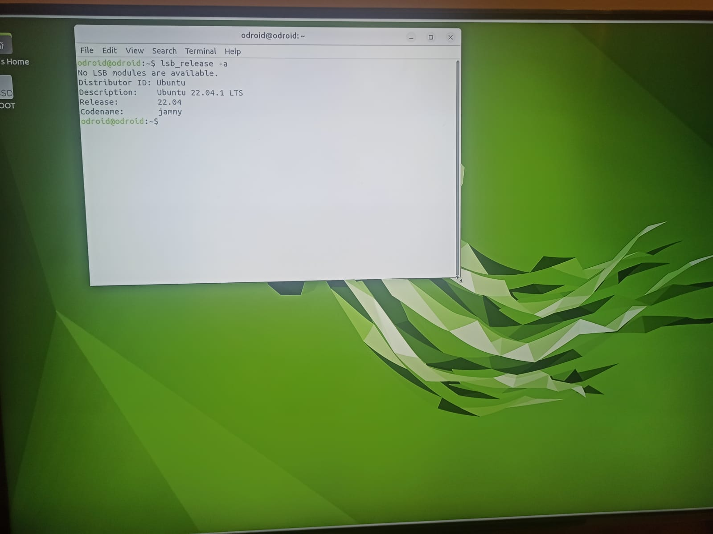
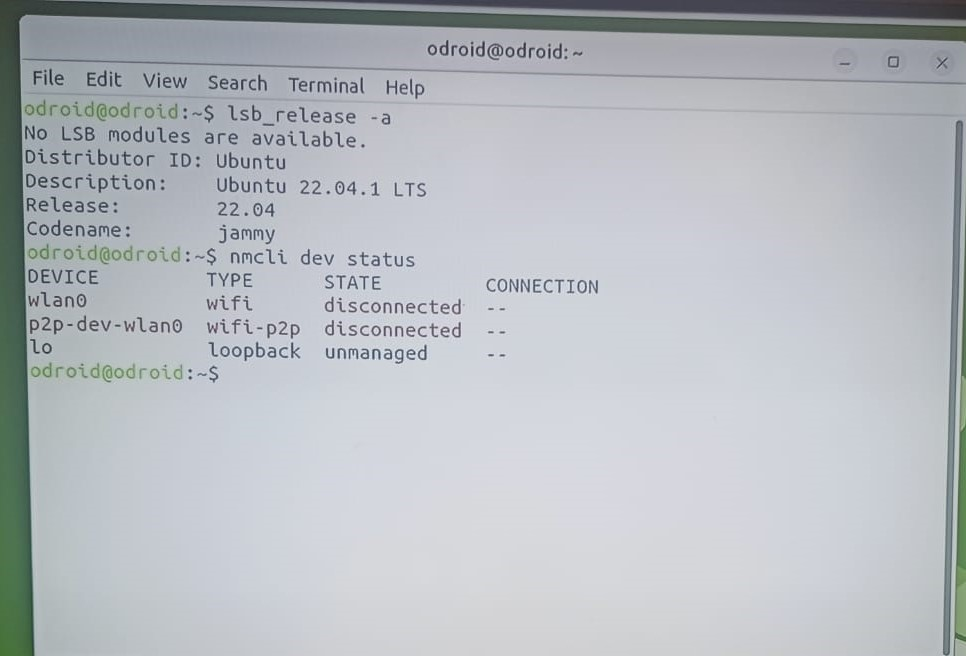
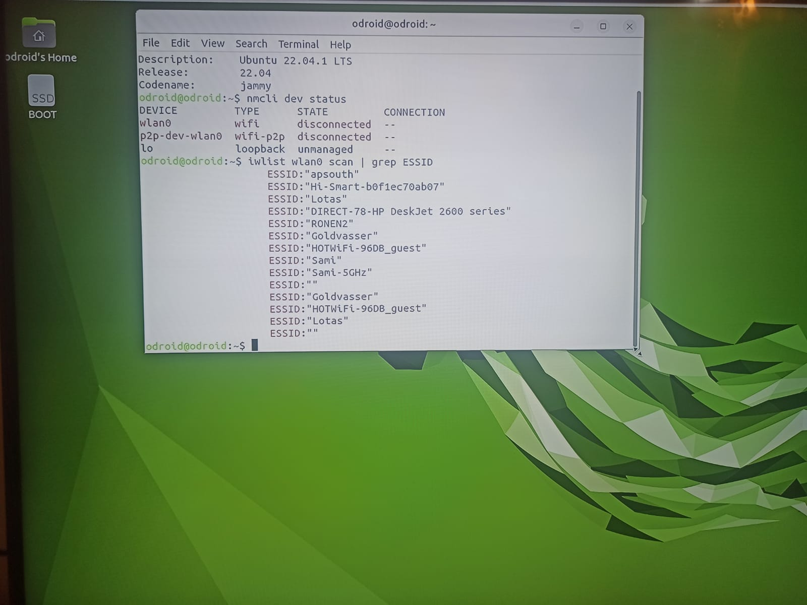
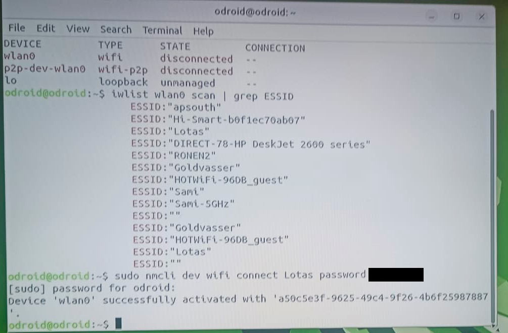
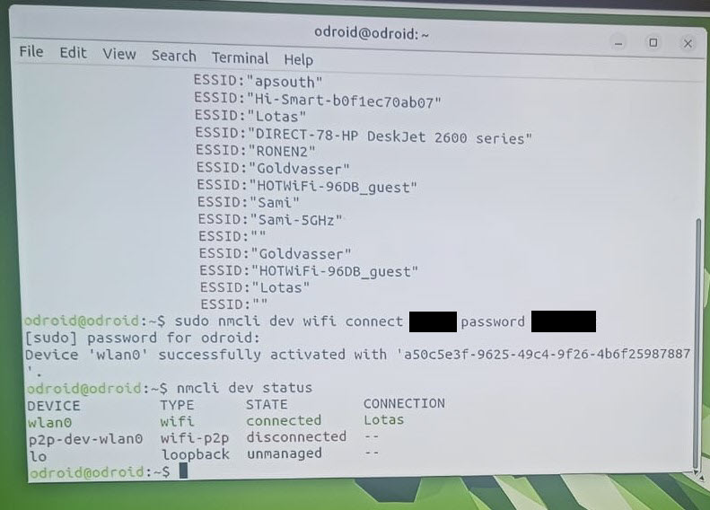

How to connect your odroid to wifi
================================

Before we start
~~~~~~~~~~~~~~~~~

-You will need the following:
-odroid
-keyborad
-hdmi cable
-any screen
-odroid power cable

Then you need to assmeble this premitive electric sheme:
Connect a keyboard to you odrdoid, connect your odroid to a screen through hdmi cable and plug the odroid to a socket using a power cable

1)Log into odroid
~~~~~~~~~~~~~~~

Now log into your odrdoid as a user, NOT as a guest

2)Open terminal
~~~~~~~~~~~~~~~~~~~

Open terminal using combination of keys Ctrl+Alt+T. You may also make it full screen by pressing Alt+F10

3)Check linux version
~~~~~~~~~~~~~~~~~~~~~~

Type ``lsb_release -a`` to check your linux version. It should be ubuntu 22.04

4)Check wifi status and interface
~~~~~~~~~~~~~~~~~~

Now type ``nmcli dev status`` to check WiFi status, it should be disconnected.
Aslo check your interface type, you'll need it further. For me it's wlan0

5)Check the list of availabel networks
~~~~~~~~~~~~~~~

Type ``iwlist wlan0 scan | grep ESSID`` to check the list of available wifi networks. 
If your interface is different from wlan0 use ``iwlist scan <your interface> scan | grep ESSID``

6)Connect to Wifi
~~~~~~~~~~~~~~~~~~~~

Type ``sudo nmcli dev wifi connect <your network name> password <your network password>``
For me network name is Lotas, and I'm not going to tell you the password :D
Then odroid will ask for user's password, default one is odroid

7)Check if everything connected correctly
~~~~~~~~~~~~~~~~~~~~

Now you can again type ``nmcli dev status`` to make sure you cennected successfully,
it should say "connected" and display correct network name.

Finish
~~~~~~~~~~~~~~~~~~~

Congratulations!!! Now your odroid is connected to a wifi network and you may procceed to the next part! 