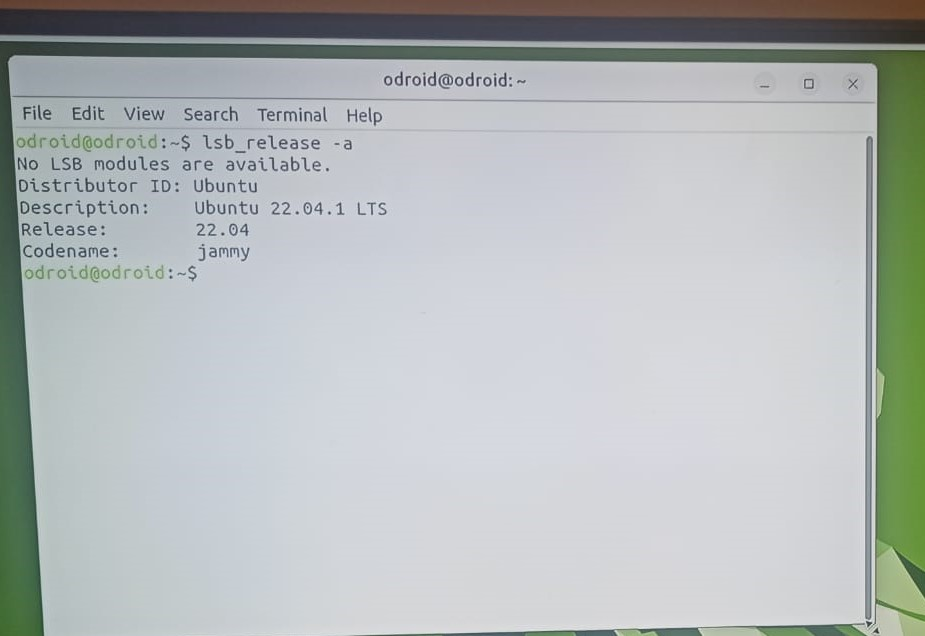

How to connect your odroid to wifi
================================

Before we start
~~~~~~~~~~~~~~~~~

You will need the following:

* single board computer Odroid
* USB keyboard
* HDMI cable
* display or TV with HDMI input
* Odroid power cable

Then you need to assmeble this primitive electric sheme:
Connect a keyboard to you Odroid, connect your Odroid to the display with hdmi cable and plug the odroid to a socket using a power cable

.. image:: images/Odroid_wifi_connect/Scheme.jpg

Step 1. Log into odroid
~~~~~~~~~~~~~~~

Now log into your odrdoid as a user, NOT as a guest

Step 2. Open terminal
~~~~~~~~~~~~~~~~~~~

Open terminal using combination of keys ``Ctrl+Alt+T``. Use ``F10`` to make it full screen if needed.

.. image:: images/Odroid_wifi_connect/odroid_wifi_step2.jpg

Step 3. Check linux version
~~~~~~~~~~~~~~~~~~~~~~

Type ``lsb_release -a`` to check your linux version. It should be ubuntu 22.04

Step 4. Check wifi status and interface
~~~~~~~~~~~~~~~~~~

Now type ``nmcli dev status`` to check WiFi status, it should be disconnected.
Aslo check your interface type, you'll need it further. For me it's wlan0

.. image:: images/Odroid_wifi_connect/odroid_wifi_step4.jpg

Step 5. Check the list of available networks
~~~~~~~~~~~~~~~

Type ``iwlist wlan0 scan | grep ESSID`` to check the list of available wifi networks. 
If your interface is different from wlan0 use ``iwlist scan <your interface> scan | grep ESSID``

.. image:: images/Odroid_wifi_connect/odroid_wifi_step5.jpg

Step 6. Connect to Wifi
~~~~~~~~~~~~~~~~~~~~

Type ``sudo nmcli dev wifi connect <your network name> password <your network password>``
Then odroid will ask for user's password, for odroid board the default one is ``odroid``

.. image:: images/Odroid_wifi_connect/odroid_wifi_step6.jpg

Step 7. Check if everything connected correctly
~~~~~~~~~~~~~~~~~~~~

Now you can again type ``nmcli dev status`` to make sure you cennected successfully,
it should say "connected" and display correct network name.

.. image:: images/Odroid_wifi_connect/odroid_wifi_step7.jpg

Finish
~~~~~~~~~~~~~~~~~~~

Congratulations!!! Now your odroid is connected to a wifi network and you may procceed to the next part! 