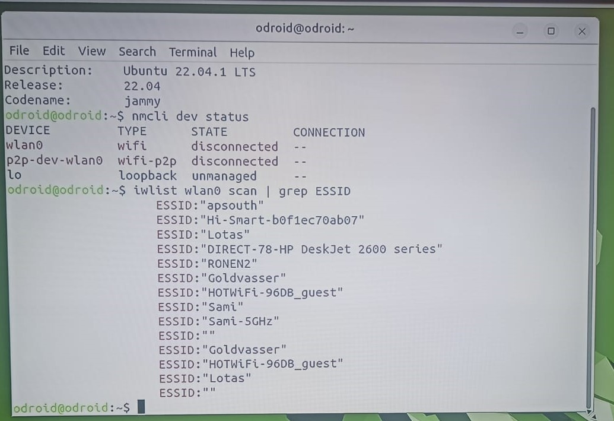
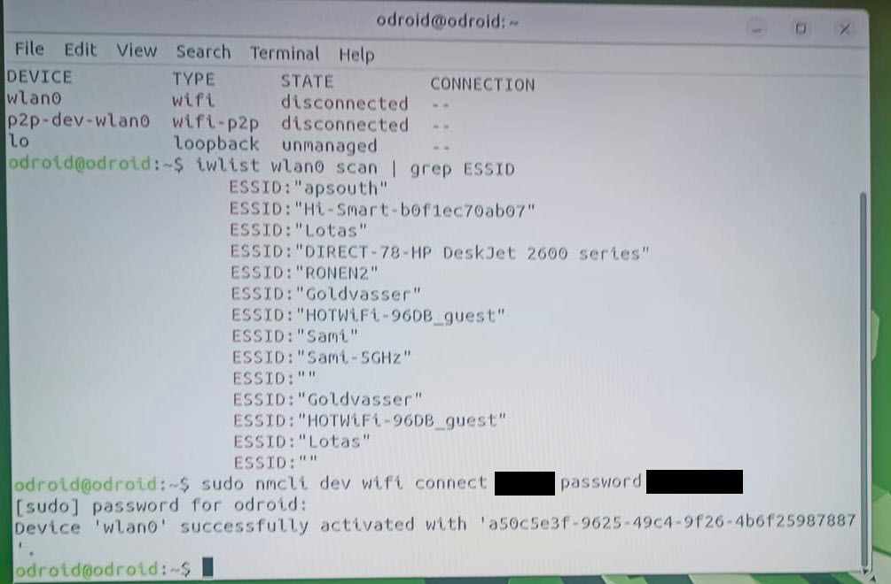

How to connect your odroid to wifi
================================

Before we start
~~~~~~~~~~~~~~~~~

You will need the following:

* single board computer Odroid
* USB keyboard
* HDMI cable
* display or TV with HDMI input
* Odroid power cable

Then you need to assmeble this primitive electric sheme:
Connect a keyboard to you Odroid, connect your Odroid to the display with hdmi cable and plug the odroid to a socket using a power cable

Step 1. Log into odroid
~~~~~~~~~~~~~~~

Now log into your odrdoid as a user, NOT as a guest

.. image:: images/Odroid_wifi_connect/odroid_wifi_step1.jpg

Step 2. Open terminal
~~~~~~~~~~~~~~~~~~~

Open terminal using combination of keys ``Ctrl+Alt+T``. Use ``F10`` to make it full screen if needed.

.. image:: images/Odroid_wifi_connect/odroid_wifi_step2.jpg

Step 3. Check linux version
~~~~~~~~~~~~~~~~~~~~~~

Type ``lsb_release -a`` to check your linux version. It should be ubuntu 22.04

.. image:: images/Odroid_wifi_connect/odroid_wifi_step3.jpg

Step 4. Check wifi status and interface
~~~~~~~~~~~~~~~~~~

Now type ``nmcli dev status`` to check WiFi status, it should be disconnected.
Aslo check your interface type, you'll need it further. For me it's wlan0

.. image:: images/Odroid_wifi_connect/odroid_wifi_step4.jpg

Step 5. Check the list of available networks
~~~~~~~~~~~~~~~

Type ``iwlist wlan0 scan | grep ESSID`` to check the list of available wifi networks. 
If your interface is different from wlan0 use ``iwlist scan <your interface> scan | grep ESSID``

Step 6. Connect to Wifi
~~~~~~~~~~~~~~~~~~~~

Type ``sudo nmcli dev wifi connect <your network name> password <your network password>``
Then odroid will ask for user's password, for odroid board the default one is ``odroid``

Step 7. Check if everything connected correctly
~~~~~~~~~~~~~~~~~~~~

Now you can again type ``nmcli dev status`` to make sure you cennected successfully,
it should say "connected" and display correct network name.

.. image:: images/Odroid_wifi_connect/odroid_wifi_step7.jpg

Step 8. Check internet connection
~~~~~~~~~~~~~~~~~~~~

Type ``ping -c 5 8.8.8.8`` to see if the computer is connected to the Internet. 8.8.8.8 is a Google server.

Step 9. Know your IP address
~~~~~~~~~~~~~~~~~~~~

Now that you have your Odroid connected to WiFi it can be accesses and managed from any 'normal' computer
using ssh. SSH server should be running on the Odroid (and it is by default), so to get connected
to Odroid one need to know:

* login - odroid 
* password - odroid 
* IP address, which we can find by typing ``hostname -I``.

In this case on the picture the IP address is 192.168.1.226

Step 10. Connect to Odroid with external terminal
~~~~~~~~~~~~~~~~~~~~

Now that you have your Odroid connected to WiFi it can be accesses and managed from any 'normal' computer
using ssh. SSH server is already installed and running on Odroid, so let's install ssh client software
onto Windows computer and connect it to the Odroid.

Any SSH client can be used, the one we prefer is MobaXterm Home Edition (free) 
- https://mobaxterm.mobatek.net/download.html

Download it, install and setup ssh session as it's shown on a picture below:

Double click session name and try to connect to the Odroid:

Finish
~~~~~~~~~~~~~~~~~~~

Congratulations!!! If all the steps are performed correctly now you don't need to connect your
Odroid device to the display or keyboard to be able to manage it. On power up the microcomputer
will be connecting to the WiFi network and can be managed from any 'normal' computer in the same
WiFi network and with ssh client software installed.