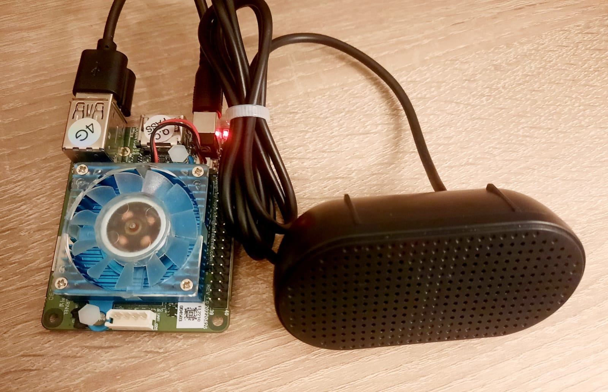
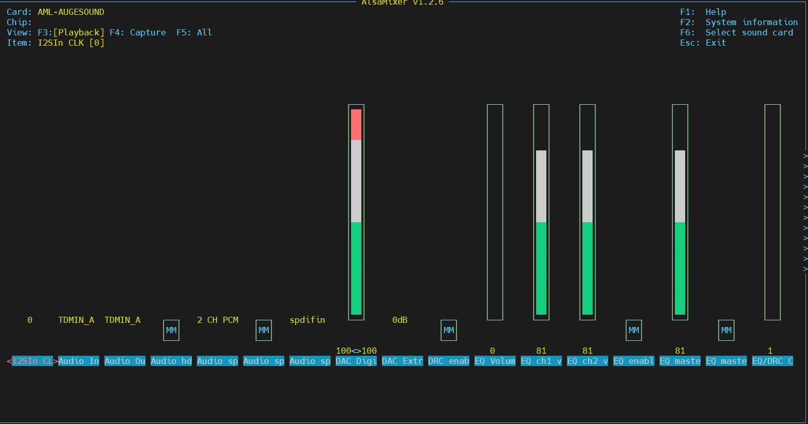
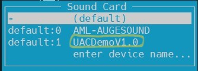
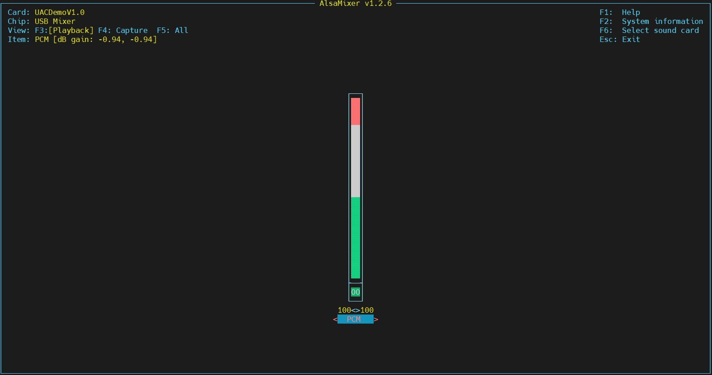

How to setup and process sounds
================================

Before we start
~~~~~~~~~~~~~~~~~

The robot uses an external USB speaker to play sounds. Please ensure that the speaker is connected to the microcomputer.

Step 1. Power up Odroid
~~~~~~~~~~~~~~~

Ensure that a WiFi dongle and a speaker are inserted into the Odroid's USB ports, 
and that the WiFi connection is configured for the microcomputer. 
Power up the Odroid and establish a connection to it using MobaXTerm.

Step 2. Setup sound level
~~~~~~~~~~~~~~~

Enter ``alsamixer`` in the terminal to open the audio volume configuration utility.

Press ``F6`` and select UACDemoV1.0 sound card. 

The initial sound level may be set to 20%. It can be increased to 100% using the button ↑

