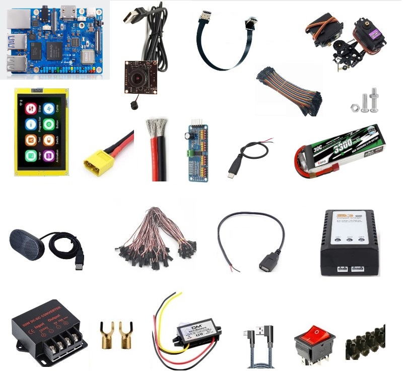

Supplies
========

Components for the robot are widely used and can be bought in different places.
We don't recommend any suppliers mentioned via links below - please select any shops/suppliers you like,
the links are provided only for reference.

* Single-board computer like Raspberry PI or Odroid as a braind with AI, camera and sound sensors
* 3d-printing with regular PLA
* Cost-effective servo motors and electronics

List of components
------------------

#. ODROID-N2L with 4GByte RAM - `<https://www.hardkernel.com/shop/odroid-n2l-with-4gbyte-ram/>`_
#. WiFi Module 5BK  - `<https://www.hardkernel.com/shop/wifi-module-5bk/>`_
#. 12V/2A power supply Asia/Korea round plug - `<https://www.hardkernel.com/shop/12v-2a-power-supply-asia-korea-round-plug/>`_
#. 16GB eMMC Module N2L Linux - `<https://www.hardkernel.com/shop/16gb-emmc-module-n2l-linux/>`_
#. DC Plug Cable Assembly 5.5mm L Type - `<https://www.hardkernel.com/shop/dc-plug-cable-assembly-5-5mm-l-type/>`_
#. Camera Module 3.6mm with Microphone NEO Coolcam 30fps HD 4MP 2560x1440 USB - `<https://a.aliexpress.com/_EGyLnnt>`_
#. Adafruit PCA9685 Servo controller - `<https://www.aliexpress.com/item/32466332558.html>`_
#. screws, nuts, terminals - `<https://www.aliexpress.com/item/32801531985.html>`_
#. MG996R Servo - `<https://www.aliexpress.com/item/4000417528570.html>`_
#. PLA (1kg) base and details - `<https://a.aliexpress.com/_mrTfJzM>`_
#. Servo tester - `<https://a.aliexpress.com/_mLtn8Ea>`_
#. LiPo battery Gens ACE 3300mAh 3S XT60 - `<https://www.aliexpress.com/item/1005003720800196.html>`_
#. Power wires XT60 female - `<https://www.aliexpress.com/item/1005005297368178.html>`_
#. 16 AWQ wire - `<https://www.aliexpress.com/item/1005001876813940.html>`_
#. ESP-LCD Display 800*480 ips rgb,8M PSRAM,16M flash - `<https://www.aliexpress.com/item/1005004788147691.html>`_ 
#. Speaker hk-5002 - `<https://a.aliexpress.com/_EwVoRaH>`_
#. Servo extension wires - `<https://www.aliexpress.com/item/4001293611208.html>`_
#. Camera extension wires 30 cm - `<https://www.aliexpress.com/item/1005001876824555.html>`_  
#. Display power wires 2pin usb-B - `<https://www.aliexpress.com/item/1005005005072094.html>`_ 
#. LiPo Charger 3S XT-60 - `<https://www.aliexpress.com/item/1005003986195734.html>`_ 
#. DC power converter 12V to 5V 15A for motors - `<https://www.aliexpress.com/item/1005003324739838.html>`_ 
#. DC power converter 12V to 5V 3A for display - `<https://www.aliexpress.com/item/33011470040.html>`_ 
#. Micro USB Typec Cable L-shape 1м - `<https://www.aliexpress.com/item/1005003132076690.html>`_ 
#. Micro USB Female 2P Charger Wire Connector - `<https://www.aliexpress.com/item/1005005904505797.html>`_ 
#. Heat-shrink tubing kit -  `<https://a.aliexpress.com/_EvesYej>`_ 
#. S12311-1677319918 Rocker Switch With Light 4 Screw Black/Red - `<https://www.setel.com.tr/En//details/1006/1082/s12311-1677319918-4-vidali-genis-isikli-anahtar-siyahkirmizi-o-i>`_  
#. Crimp Spade Terminal connector pack -  `<https://www.aliexpress.com/item/1005003611683326.html>`_ 
#. Jumper wire dupont cable for DIY kit. female to female `<https://www.aliexpress.com/item/4000203371860.html>`_ 

.. list-table:: Robot components
    :widths: 10 25 50 25
    :header-rows: 1

    *   - N
        - name
        - shopping link
        - price $
    *   - 1
        - ODROID-N2L with 4GByte RAM
        - `<https://www.hardkernel.com/shop/odroid-n2l-with-4gbyte-ram/>`
        - 69 
    *   - Row 2, column 1
        - Row 2, column 2
        - Row 2, column 3
        - Row 2, column 4