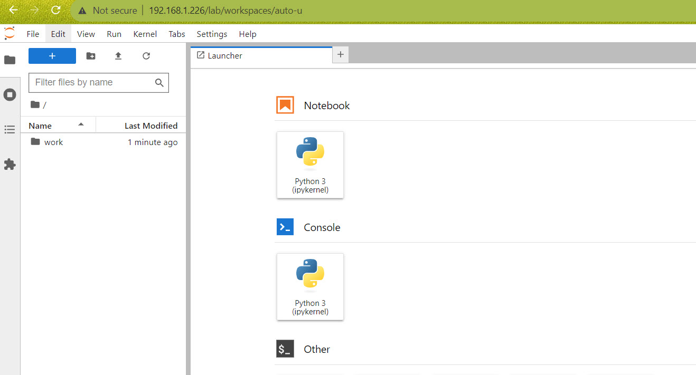
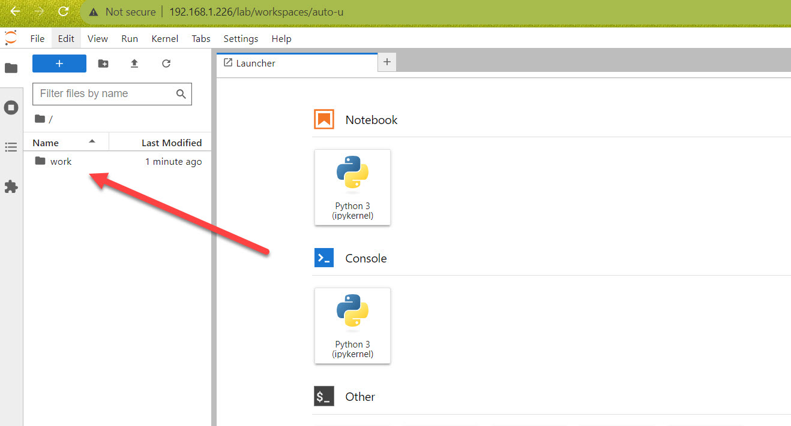
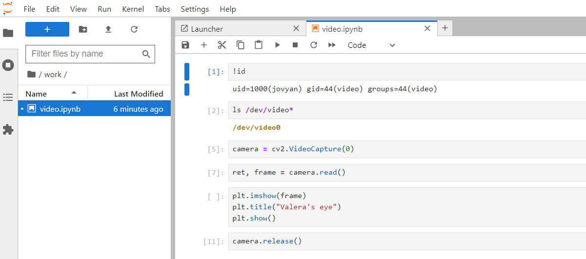

How to process robot video
================================

Before we start
~~~~~~~~~~~~~~~~~

The robot utilizes USB camera to explore the environment.

To get started with video processing you will need the following:

* single board computer Odroid with WiFi and SSH set and running
* USB WiFi dongle
* Odroid power cable
* USB web camera
* SSH terminal client software installed on PC or laptop. We'll be using MobaXTerm for
demonstration purposes, but any other SSH terminal client can be used.

Insert WiFi dongle and web camera into Odroid's USB ports and you're ready to go.

Step 1. Power up Odroid
~~~~~~~~~~~~~~~

Ensure that WiFi dongle and web camera are inserted into the Odroid's USB ports and
WiFi connection is set for the microcomputer. Power up Odroid and connect to it
with MobaXTerm.

Step 2. Copy Valera code to Odroid 
~~~~~~~~~~~~~~~

Valera code is a free and open source software repository with example code to control the robot.
Create a separete folder to store the code: ``mkdir Code && cd Code``

Copy the repository code to the new folder: ``git clone https://github.com/goodlancer-org/valera-code``
Change the current working directory to the folder with code: ``cd valera-code``

Step 3. Run Valera code 
~~~~~~~~~~~~~~~

Valera code includes files to run docker, to start a JupyterLab server on Odroid and workbooks
with example code for the robot.

To start Valera code type ``sudo docker compose up``

When the server is running go to your laptop, open a browser and navigate to
``http://[odroid_ip_address]``, in my case it will be ``http://192.168.1.226``

The password for Jupyter is ``Valera``

Step 4. Explore example code 
~~~~~~~~~~~~~~~

When in Jupyter open up 'work' folder to see the example workbook.

Double click ``video.ipynb`` file to open example code.

Finish
~~~~~~~~~~~~~~~~~~~

All the example code for Valera (dockerfiles, docker compose, shell scripts, python code)
is provided free and open source. Please feel free to change it to adopt to your needs.
